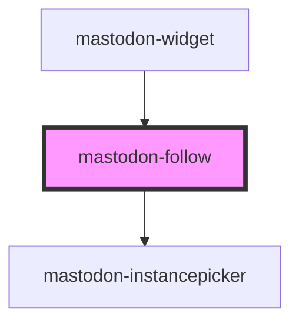

# mastodon-follow

You can use this to progressively enhance any HTML element to become a follow button.

```html
<mastodon-follow account="splitbrain@octodon.social">
    <a href="https://octodon.social/@splitbrain">Follow me</a>
</mastodon-follow>
```

Note: the component will apply `pointer-events: none` to all top-level `a` elements to prevent the default click action. If you have a better idea on how to achieve this, please let me know.

<!-- Auto Generated Below -->

## Overview

A wrapper around any HTML which will capture clicks and execute a follow action instead.

## Properties

| Property  | Attribute | Description                                          | Type     | Default     |
| --------- | --------- | ---------------------------------------------------- | -------- | ----------- |
| `account` | `account` | The account to follow in the form `user@example.com` | `string` | `undefined` |

## Dependencies

### Used by

- [mastodon-widget](../mastodon-widget)

### Depends on

- [mastodon-instancepicker](../mastodon-instancepicker)

### Graph



---

_Built with [StencilJS](https://stenciljs.com/)_
