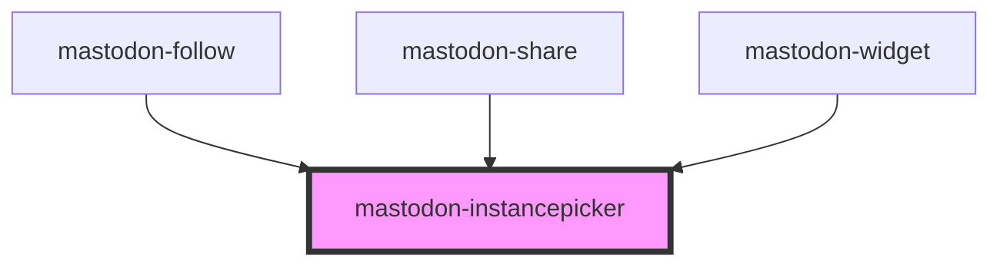

# mastodon-instancepicker

This component lets the user pick a Mastodon instance by typing. A list of matching instances is shown for selection by mouse or keyboard navigation.

End users usually will not use this component directly, it is used internally by other components.

Adding this component will add the dialog as closed. You can open it by calling the `pickInstance()` method, which will return a promise that resolves to the selected instance.

<!-- Auto Generated Below -->

## Overview

A dialog widget to let a user pick their Mastodon instance.

## Properties

| Property  | Attribute | Description      | Type     | Default     |
| --------- | --------- | ---------------- | -------- | ----------- |
| `account` | `account` | currently unused | `string` | `undefined` |

## Methods

### `close(event: MouseEvent) => Promise<void>`

Close the dialog without picking an instance.

#### Returns

Type: `Promise<void>`

### `pickInstance() => Promise<string>`

Open the dialog and let the user pick an instance.

#### Returns

Type: `Promise<string>`

## CSS Custom Properties

| Name                  | Description                                                                 |
| --------------------- | --------------------------------------------------------------------------- |
| `--button-background` | background color of the selected instance and the picker button             |
| `--button-color`      | text color of the selected/highlighted instance and the picker button       |
| `--button-hover`      | background color of the highlighted instance and the picker button on hover |
| `--color-background`  | background color of the dialog                                              |
| `--color-link`        | link color                                                                  |
| `--color-text`        | text color used in the dialog                                               |

## Dependencies

### Used by

- [mastodon-follow](../mastodon-follow)
- [mastodon-share](../mastodon-share)
- [mastodon-widget](../mastodon-widget)

### Graph

---

_Built with [StencilJS](https://stenciljs.com/)_
