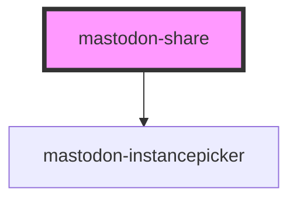

# mastodon-share

You can use this to create a share button. The body of the component can be arbitrary HTML.

When clicked, the component will open the [instancepicker](../mastodon-instancepicker/readme.md) component and then redirect to the selected instance with the share dialog open.

```html

<mastodon-share
        account="splitbrain@octodon.social"
        url="https://www.splitbrain.org"
        text="Check out Andi's homepage!"
>
    <button>Share this on Mastodon</button
</mastodon-share>
```

Note: the component will apply `pointer-events: none` to all top-level `a` elements to prevent the default click action. If you have a better idea on how to achieve this, please let me know.

<!-- Auto Generated Below -->

## Overview

A wrapper around any HTML which will share a page on the selected instance.

## Properties

| Property  | Attribute | Description                                              | Type     | Default     |
| --------- | --------- | -------------------------------------------------------- | -------- | ----------- |
| `account` | `account` | unused                                                   | `string` | `undefined` |
| `text`    | `text`    | The text to share. Defaults to the current page's title. | `string` | `undefined` |
| `url`     | `url`     | The URL to share. Defaults to the current page.          | `string` | `undefined` |

## Dependencies

### Depends on

- [mastodon-instancepicker](../mastodon-instancepicker)

### Graph



---

_Built with [StencilJS](https://stenciljs.com/)_
