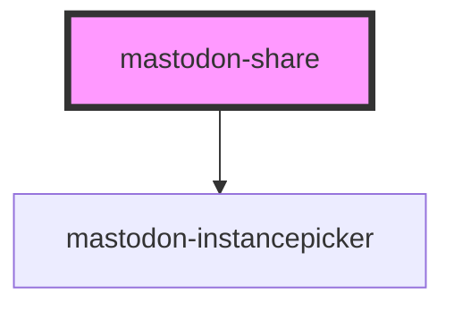

# mastodon-share

<!-- Auto Generated Below -->

## Overview

A wrapper around any HTML which will share a page on the selected instance.

## Properties

| Property  | Attribute | Description                                              | Type     | Default     |
| --------- | --------- | -------------------------------------------------------- | -------- | ----------- |
| `account` | `account` | unused                                                   | `string` | `undefined` |
| `text`    | `text`    | The text to share. Defaults to the current page's title. | `string` | `undefined` |
| `url`     | `url`     | The URL to share. Defaults to the current page.          | `string` | `undefined` |

## Dependencies

### Depends on

- [mastodon-instancepicker](../mastodon-instancepicker)

### Graph

---

_Built with [StencilJS](https://stenciljs.com/)_
