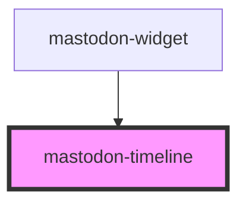

# mastodon-timeline

<!-- Auto Generated Below -->

## Overview

A widget to display the timeline of a Mastodon account

This makes use of the RSS feed of the account.

## Properties

| Property  | Attribute | Description                                                                       | Type     | Default     |
| --------- | --------- | --------------------------------------------------------------------------------- | -------- | ----------- |
| `account` | `account` | The account for which the timeline should be shown in the form `user@example.com` | `string` | `undefined` |
| `limit`   | `limit`   | The number of toots to display                                                    | `number` | `10`        |

## CSS Custom Properties

| Name                 | Description                   |
| -------------------- | ----------------------------- |
| `--color-background` | background color of the toots |
| `--color-link`       | link color                    |
| `--color-text`       | text color used in the toots  |

## Dependencies

### Used by

 - [mastodon-widget](../mastodon-widget)

### Graph

----------------------------------------------

*Built with [StencilJS](https://stenciljs.com/)*
