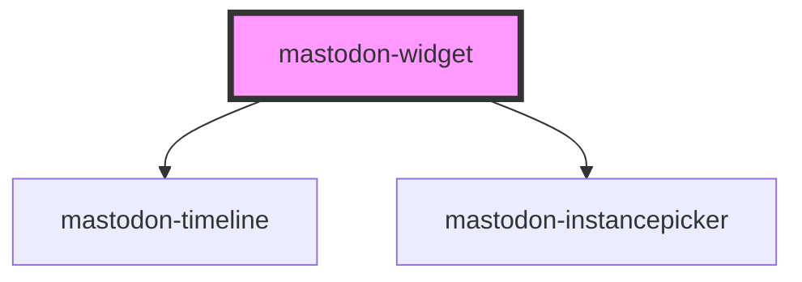

# mastodon-widget

<!-- Auto Generated Below -->

## Overview

A widget to display a Mastodon account and its timeline.

## Properties

| Property  | Attribute | Description                                                    | Type     | Default     |
| --------- | --------- | -------------------------------------------------------------- | -------- | ----------- |
| `account` | `account` | The account to display in the form `user@example.com`          | `string` | `undefined` |
| `limit`   | `limit`   | The number of toots to display. `0` for disabling the timeline | `number` | `10`        |

## CSS Custom Properties

| Name                  | Description                                    |
| --------------------- | ---------------------------------------------- |
| `--button-background` | background color of the follow button          |
| `--button-color`      | text color of the follow button                |
| `--button-hover`      | background color of the follow button on hover |
| `--color-background`  | background color of the widget                 |
| `--color-link`        | link color                                     |
| `--color-text`        | text color used in the widget                  |

## Dependencies

### Depends on

- [mastodon-timeline](../mastodon-timeline)
- [mastodon-instancepicker](../mastodon-instancepicker)

### Graph

----------------------------------------------

*Built with [StencilJS](https://stenciljs.com/)*
